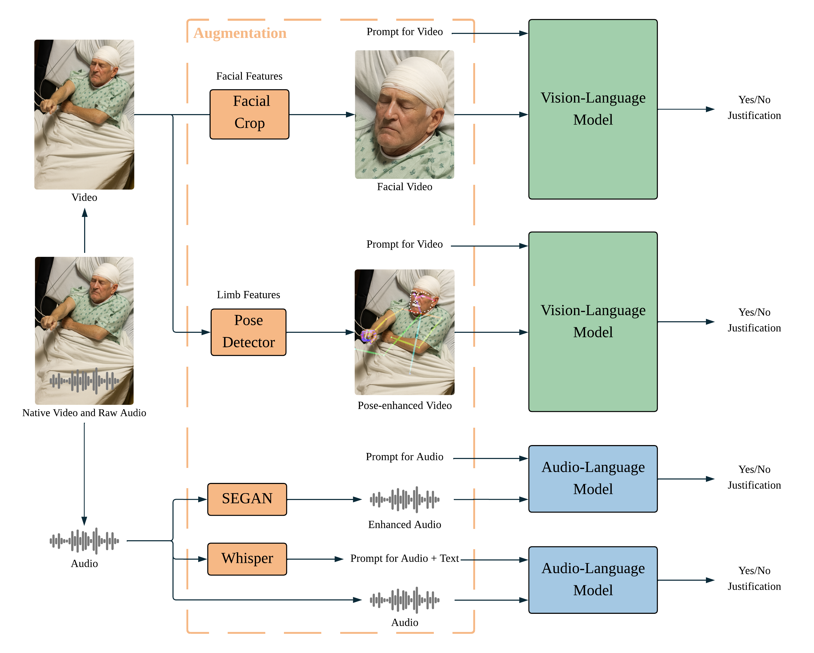

# Can Multimodal Large Language Models Understand Pathologic Movements? A Pilot Study on Seizure Semiology

> **EMBC 2025** | [Paper](EMBC_Paper.pdf)

Official implementation of **"Can Multimodal Large Language Models Understand Pathologic Movements? A Pilot Study on Seizure Semiology"**, accepted at the IEEE Engineering in Medicine and Biology Conference (EMBC) 2025.

We present the **first systematic evaluation of MLLMs for comprehensive seizure semiology recognition**, benchmarking zero-shot MLLMs against fine-tuned CNN/ViT baselines across 20 ILAE-defined semiological features in 90 clinical seizure recordings.

---
## Overview



**Three signal enhancement strategies** target different feature groups:
- **Facial features** → temporal face crop (Sapiens keypoints)
- **Limb/body features** → OpenPose skeleton overlay
- **Audio features** → SEGAN speech enhancement + Whisper ASR transcript

---

## Semiological Features

20 ILAE-standardized features across three modalities:

| Category | Features |
|---|---|
| **Limb & Body (11)** | arm_flexion, arm_straightening, arms_move_simultaneously, tonic, clonic, figure4, limb_automatisms, asynchronous_movement, pelvic_thrusting, full_body_shaking, occur_during_sleep |
| **Facial (7)** | blank_stare, close_eyes, eye_blinking, oral_automatisms, face_pulling, face_twitching, head_turning |
| **Audio (2)** | verbal_responsiveness, ictal_vocalization |

---

## Key Results

Zero-shot MLLMs outperformed fine-tuned CNN/ViViT baselines on **13 of 18 visual semiological features** by F1 score — without any task-specific training data. Feature-targeted signal enhancement (pose overlay, face crop, audio denoising + ASR) further improved performance on **10 of 20 features** (visual + audio combined).

### Feature-level Highlights

Representative feature-level F1 scores from Tables II–IV in the paper:

| Feature | Group | CNN F1 | ViViT F1 | Qwen2.5-VL F1 | InternVL3.5 F1 | Best enhanced setting | Best enhanced F1 |
|---|---|---:|---:|---:|---:|---|---:|
| Occur during sleep | Limb/body | 0.733 | 0.510 | 0.583 | **0.771** | Pose + InternVL3.5 | 0.750 |
| Arm flexion | Limb/body | 0.731 | 0.720 | **0.800** | 0.771 | Pose + InternVL3.5 | 0.724 |
| Arm straightening | Limb/body | 0.447 | 0.442 | **0.582** | 0.556 | Pose + Qwen2.5-VL | 0.528 |
| Figure-4 posture | Limb/body | 0.126 | 0.332 | **0.462** | 0.296 | Pose + Qwen2.5-VL | 0.222 |
| Tonic | Limb/body | 0.321 | 0.506 | 0.316 | 0.409 | Pose + InternVL3.5 | **0.537** |
| Asynchronous movement | Limb/body | **0.690** | 0.674 | 0.514 | 0.575 | Pose + Qwen2.5-VL | 0.406 |
| Full-body shaking | Limb/body | **0.513** | 0.412 | 0.304 | 0.375 | Pose + InternVL3.5 | 0.375 |
| Blank stare | Facial | 0.569 | 0.583 | 0.631 | 0.608 | Crop + Qwen2.5-VL | **0.632** |
| Closed eyes | Facial | 0.410 | 0.393 | **0.524** | 0.422 | Crop + Qwen2.5-VL | 0.458 |
| Face pulling | Facial | 0.463 | 0.453 | 0.222 | 0.293 | Crop + InternVL3.5 | **0.521** |
| Face twitching | Facial | 0.531 | 0.527 | 0.533 | **0.548** | Crop + Qwen/InternVL | **0.548** |
| Head turning | Facial | **0.325** | 0.317 | 0.320 | 0.000 | Crop + Qwen2.5-VL | 0.276 |

Audio features were evaluated with Audio Flamingo 3 rather than CNN/ViViT baselines:

| Feature | AF3 F1 | SEGAN + AF3 F1 | ASR + AF3 F1 |
|---|---:|---:|---:|
| Verbal responsiveness | **0.380** | 0.286 | 0.193 |
| Ictal vocalization | 0.773 | 0.567 | **0.793** |

**Strengths:** MLLMs were most effective on salient postural and contextual cues, including sleep state, arm flexion/straightening, Figure-4 posture, blank stare, and tonic events with pose enhancement.

**Limitations:** Performance lagged on subtle or high-frequency movements, including eye blinking, head turning, oral automatisms, asynchronous movement, and full-body shaking.

### Explainability

Expert review rated **94.3%** of MLLM justifications for correctly predicted cases at ≥60% faithfulness, supporting clinician-in-the-loop interpretability.

---


## Repository Structure

```
MLLMonPathologicalMovements/
├── feature_extraction/         # MLLM inference: visual feature extraction
│   ├── internvl35_38B_pose.py  # InternVL3.5-38B + pose overlay (limb features)
│   ├── internvl35_38B_crop.py  # InternVL3.5-38B + face crop (facial features)
│   ├── internvl3.5_8B.py       # InternVL3.5-8B, all 18 visual features
│   ├── qwen-2.5-VL-32B_pose.py # Qwen2.5-VL-32B + pose overlay
│   ├── qwen-2.5-VL-32B_crop.py # Qwen2.5-VL-32B + face crop
│   ├── Qwen-2.5-VL-32B-Instruct.py  # Qwen2.5-VL-32B, all 18 visual features
│   ├── Audio-Flamingo-3.py     # AF3 audio model (verbal_responsiveness, ictal_vocalization)
│   ├── pose/                   # Frame extraction and skeleton overlay utilities
│   │   ├── video_to_frames.py
│   │   ├── video_to_frames_parallel.py
│   │   ├── frames_to_video.py
│   │   └── organize_jpgs.py
│   └── crop/                   # Face detection and cropping utilities
│       ├── sapiens.py
│       └── keypoint_info.py
├── video_audio_augmetation/    # Audio preprocessing pipeline
│   ├── audio_aug.py            # SEGAN speech enhancement
│   ├── extract_text_from_audio.py  # Whisper ASR transcription
│   └── Audio-Flamingo-3_Audio+Text.py  # AF3 with audio + transcript input
├── cnn_vit/                    # Supervised baselines (CNN / ViViT)
│   ├── finetune_vit_by_folder.py       # ViViT fine-tuning (patient-stratified 3-fold CV)
│   ├── finetune_cnn_by_folder.py       # 3D CNN fine-tuning (R3D, MC3, R2Plus1D)
│   ├── aggregate_patient_predictions.py # Segment → patient aggregation
│   ├── evaluate_patient_predictions.py  # Metrics with threshold tuning
│   └── filter_videos_by_csv.py
├── prompt_optimization/        # Prompt robustness and sensitivity analysis
│   ├── prompt_robustness.py    # Multi-prompt evaluation + GEPA hook
│   ├── mllm_video_backend.py   # JSONL-based persistent inference backend
│   └── requirements-prompt-optimization.txt
├── evaluation/                 # Metric computation
│   ├── video/
│   │   ├── featuremetrics.py         # Per-feature accuracy/precision/recall/F1
│   │   └── merge_segment_feature.py  # Segment-level → video-level aggregation
│   └── audio/
│       ├── generate_csv.py
│       └── calculate_metrics.py
├── internvl_installation.md    # Environment setup for InternVL3.5
├── qwen25vl_installation.md    # Environment setup for Qwen2.5-VL
└── requirements-benchmarks.txt
```

---

## Installation

### Prerequisites

- Python 3.10
- CUDA 12.2 or 12.4
- Conda

### Environment for InternVL3.5

```bash
conda create -n internvl3_5 python=3.10 -y
conda activate internvl3_5
python -m pip install -U pip

# CUDA 12.4
pip install torch torchvision torchaudio torchcodec \
  --extra-index-url https://download.pytorch.org/whl/cu124

# CUDA 12.2
pip install torch torchvision torchaudio torchcodec \
  --extra-index-url https://download.pytorch.org/whl/cu121

pip install lmdeploy==0.9.2.post1 transformers==4.51.0 huggingface-hub==0.33.2 \
  accelerate==1.8.1 safetensors==0.5.3 tokenizers==0.21.2 timm==1.0.16 einops==0.8.1 \
  decord==0.6.0 pillow==11.0.0 numpy==1.26.4 pandas==2.3.1 tqdm==4.67.1 \
  requests==2.32.4 PyYAML==6.0.2
```

See [internvl_installation.md](internvl_installation.md) for full instructions including Hugging Face token setup.

### Environment for Qwen2.5-VL

```bash
conda create -n qwenvl python=3.10 -y
conda activate qwenvl

# CUDA 12.4
pip install torch torchvision torchaudio torchcodec \
  transformers==4.51.3 accelerate qwen-vl-utils pandas peft tqdm numpy scipy \
  datasets deepspeed \
  --extra-index-url https://download.pytorch.org/whl/cu124

# FlashAttention (ABI compatibility fix)
pip install --upgrade setuptools wheel && \
pip uninstall -y flash-attn || true && \
pip cache purge && \
FLASH_ATTENTION_FORCE_BUILD=TRUE pip install flash-attn --no-build-isolation --no-cache-dir
```

See [qwen25vl_installation.md](qwen25vl_installation.md) for CUDA 12.2 instructions.

### Hugging Face Login

```bash
huggingface-cli login
```

---

## Usage

### Step 1: MLLM Visual Feature Extraction

**InternVL3.5-38B — limb/body features (with pose overlay):**
```bash
python feature_extraction/internvl35_38B_pose.py \
  --gpu 0 \
  --tp 1 \
  --dataset_dir /path/to/videos \
  --output_dir /path/to/output \
  --videos_range 1-90 \
  --max_frames 60
```

**InternVL3.5-38B — facial features (with face crop):**
```bash
python feature_extraction/internvl35_38B_crop.py \
  --gpu 0 \
  --dataset_dir /path/to/videos \
  --output_dir /path/to/output \
  --videos_range 1-90
```

**Qwen2.5-VL-32B — limb/body features:**
```bash
python feature_extraction/qwen-2.5-VL-32B_pose.py \
  --gpu 0 \
  --dataset_dir /path/to/videos \
  --output_dir /path/to/output \
  --videos_range 1-90
```

**Audio Flamingo 3 — audio features:**
```bash
python feature_extraction/Audio-Flamingo-3.py \
  --gpu 0 \
  --dataset_dir /path/to/audio \
  --output_dir /path/to/output
```

Common arguments:

| Argument | Default | Description |
|---|---|---|
| `--gpu` | required | GPU device ID(s) |
| `--dataset_dir` | required | Input video/audio directory |
| `--output_dir` | required | Output CSV directory |
| `--cache_dir` | `./model_cache/` | Model weights cache |
| `--videos_range` | `1-2314` | Inclusive 1-indexed range of videos to process |
| `--max_frames` | `60` | Frames sampled per segment |
| `--max_new_tokens` | `2048` | Max generation length |
| `--max_retries` | `10` | Retries on inference failure |

### Step 2: Signal Enhancement Preprocessing

**Frame extraction:**
```bash
python feature_extraction/pose/video_to_frames.py \
  /path/to/videos /path/to/frames --fps 2
```

**Face cropping (Sapiens-based):**
```bash
python feature_extraction/crop/sapiens.py \
  /path/to/raw_frames /path/to/pose_frames /path/to/crop_output
```

**Audio denoising (SEGAN):**
```bash
python video_audio_augmetation/audio_aug.py
```

**Speech transcription (Whisper):**
```bash
python video_audio_augmetation/extract_text_from_audio.py \
  /path/to/wav_files /path/to/transcripts --model_size large
```

### Step 3: Supervised Baseline Fine-tuning (CNN / ViViT)

**ViViT fine-tuning with patient-stratified 3-fold CV:**
```bash
python cnn_vit/finetune_vit_by_folder.py \
  --video_dirs /path/to/videos \
  --output_dir /path/to/checkpoints
```

**Patient-level prediction aggregation:**
```bash
python cnn_vit/aggregate_patient_predictions.py \
  --predictions_root /path/to/preds \
  --feature arm_flexion \
  --output aggregated.csv \
  --agg max
```

**Evaluation:**
```bash
python cnn_vit/evaluate_patient_predictions.py
```

### Step 4: Evaluation

**Video feature metrics:**
```bash
python evaluation/video/featuremetrics.py
```

**Segment → video aggregation:**
```bash
python evaluation/video/merge_segment_feature.py
```

---

## Dataset

90 seizure video recordings from 29 consecutive adult patients undergoing video-EEG monitoring at **UCLA Medical Center (2019–2023)**.

- **Camera:** SONY EP 580, 1920×1080 @ 30 FPS
- **Audio:** 44.1 kHz mono
- **Annotation:** Three independent epileptologists annotated 20 ILAE semiological features per video
- **Ethics:** IRB approved under protocol **IRB-23-0054** (UCLA)

> The dataset contains identifiable patient information and is **not publicly released**. Researchers wishing to access the data should contact the corresponding authors and comply with IRB requirements.


---

## Models

| Model | Role | Source |
|---|---|---|
| InternVL3.5-38B | Visual feature extraction | `OpenGVLab/InternVL3_5-8B` |
| Qwen2.5-VL-32B | Visual feature extraction | `Qwen/Qwen2.5-VL-32B-Instruct` |
| Audio Flamingo 3 | Audio feature extraction | `nvidia/audio-flamingo-3` |
| OpenPose | Skeleton keypoint overlay | [CMU-Perceptual-Computing-Lab/openpose](https://github.com/CMU-Perceptual-Computing-Lab/openpose) |
| Sapiens | Face keypoint detection for crop | Meta Research |
| SEGAN | Speech enhancement | Pascual et al., 2017 |
| Whisper-large | Speech-to-text transcription | OpenAI |
| ViViT (google/vivit-b-16x2-kinetics400) | Supervised baseline | HuggingFace |
| R3D-18 / MC3-18 / R2Plus1D-18 | Supervised baseline (3D CNN) | torchvision |

---

## Prompt Design

Prompts were developed collaboratively with three epileptologists. Clinical terminology is translated into observable behavioral descriptions to align with general-purpose MLLM pretraining. Example prompts:

| Feature | Prompt |
|---|---|
| **Oral Automatisms** | Does the patient exhibit repetitive, stereotyped mouth or tongue movements such as chewing, lip-smacking, or swallowing? |
| **Figure-4 Arms** | Does the patient's posture resemble a "figure-4" pattern, with one arm flexed and the other extended? |
| **Pelvic Thrusting** | Does the patient display repetitive, rhythmic, anteroposterior (forward-and-backward) movements of the hips? |
| **Ictal Vocalization** | Does the patient make any groaning, moaning, guttural sounds or do they utter stereotyped repetitive phrases? |

---

## Citation

If you use this code or the dataset, please cite:

```bibtex
@inproceedings{zhang2025mllm,
  title     = {Can Multimodal Large Language Models Understand Pathologic Movements?
               A Pilot Study on Seizure Semiology},
  author    = {Zhang, Lina and Monsoor, Tonmoy and Lorasdagi, Mehmet Efe and
               Sinha, Prateik and Han, Chong and Li, Peizheng and Wang, Yuan and
               Pasqua, Jessica and McCrimmon, Colin and Mazumder, Rajarshi and
               Roychowdhury, Vwani},
  booktitle = {Proceedings of the IEEE Engineering in Medicine and Biology Conference (EMBC)},
  year      = {2025}
}
```

---


## License

This repository is released for research purposes only. The clinical dataset is not included and remains subject to UCLA IRB restrictions. Please contact the authors before any clinical or commercial use.
